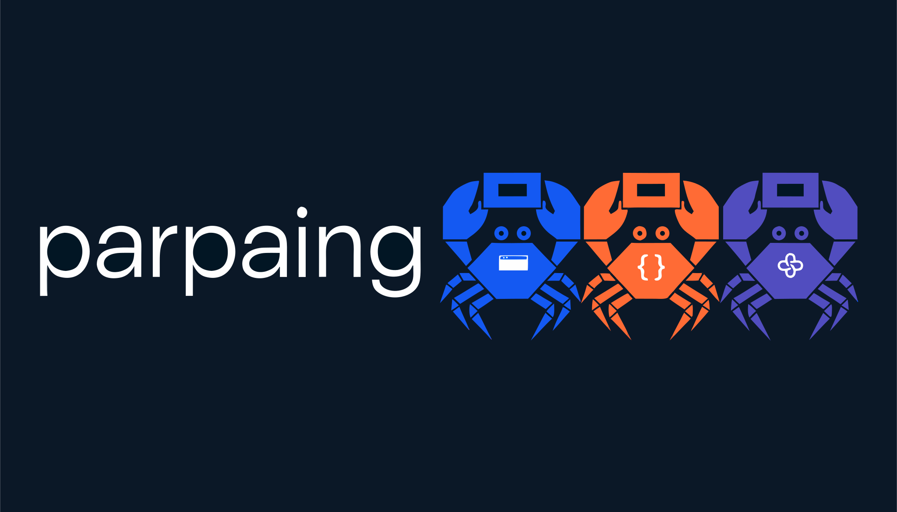
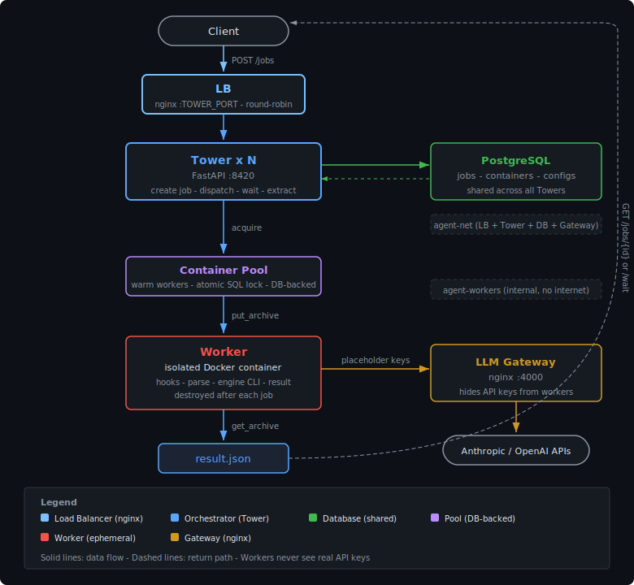
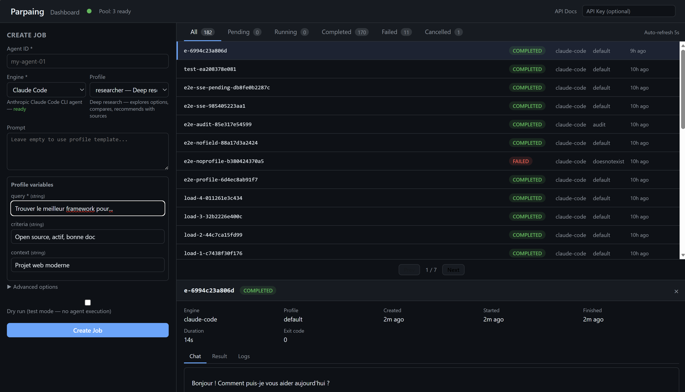
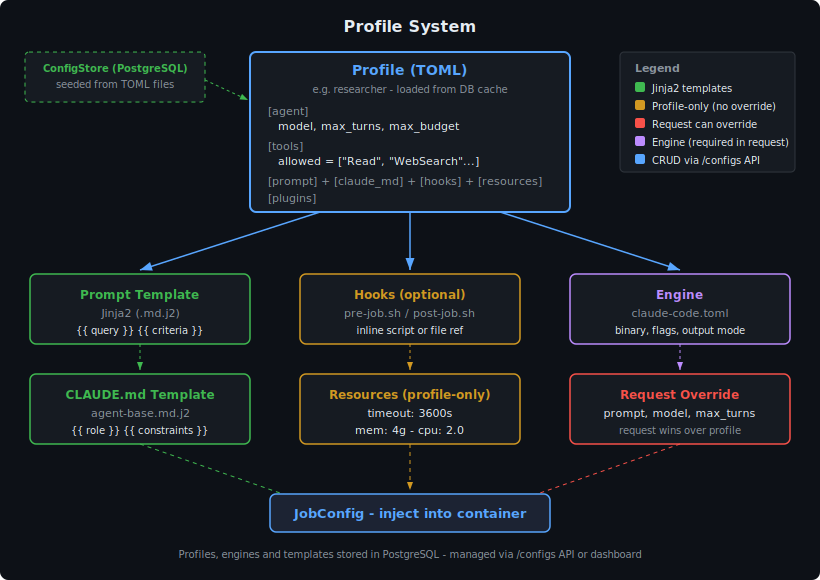

<p align="center">
  
</p>

<h1 align="center">Parpaing</h1>

<p align="center">
  <strong>The building block for AI agents.</strong><br/>
  Run any AI coding agent in isolated Docker containers via a simple REST API.
</p>

<p align="center">
  <a href="https://github.com/enixCode/parpaing-agent-worker"></a>
  <a href="https://github.com/enixCode/parpaing-agent-worker"></a>
  <a href="https://github.com/enixCode/parpaing-agent-worker"></a>
  <a href="https://github.com/enixCode/parpaing-agent-worker"></a>
  <a href="https://github.com/enixCode/parpaing-agent-worker"></a>
  <a href="https://github.com/enixCode/parpaing-agent-worker/blob/main/LICENSE"></a>
</p>

Send a prompt, get structured results. Parpaing handles container orchestration, job queuing, and result collection. Use it standalone or as the execution backend behind your own SaaS.

> **Status: MVP** - Core features work (job queue, container pool, dashboard, multi-engine). Not production-hardened yet. See [Roadmap](#roadmap) for what's planned.
>
> **What works:** create/poll/cancel/wait jobs, profiles, web dashboard, multi-tower scaling, Prometheus metrics, LLM gateway.
>
> **What's missing for production:** multi-tenant auth, rate limiting, file upload, cost tracking, CI/CD.

## Architecture

<p align="center">
  
</p>

## Quick Start

```bash
cp .env.example .env
# Set POSTGRES_PASSWORD and at least one engine auth key (see .env.example)

docker compose up --build -d

# Open dashboard
open http://localhost:8420/ui
```

<p align="center">
  
</p>

## Usage

### Python

```python
import requests

API = "http://localhost:8420"

# Create a job and wait for the result (blocking)
r = requests.post(f"{API}/jobs", json={
    "agent_id": "test",
    "engine": "claude-code",
    "prompt": "List files in /workspace",
})
job_id = r.json()["job_id"]

# Wait for completion (blocks until done, timeout 1h by default)
result = requests.get(f"{API}/jobs/{job_id}/wait").json()
print(result["status"])   # completed / failed
print(result["result"])   # agent output

```

```python
# Use a profile with variables
r = requests.post(f"{API}/jobs", json={
    "agent_id": "search",
    "engine": "claude-code",
    "profile": "researcher",
    "prompt_vars": {"query": "best CI tools"},
})
result = requests.get(f"{API}/jobs/{r.json()['job_id']}/wait").json()
```

### curl

```bash
# Create + wait
JOB_ID=$(curl -s -X POST http://localhost:8420/jobs \
  -H "Content-Type: application/json" \
  -d '{"agent_id":"test","engine":"claude-code","prompt":"Hello"}' | jq -r .job_id)

curl http://localhost:8420/jobs/$JOB_ID/wait    # blocks until done

# Cancel
curl -X DELETE http://localhost:8420/jobs/$JOB_ID
```

## API

See [API Reference](api.md) for full reference and [Request Format](request.md) for request fields.

Interactive docs available at [/docs](http://localhost:8420/docs) when running.

## Profiles

Profiles are reusable agent configurations in TOML. They define the model, tools, prompt template, hooks, and resource limits.

<p align="center">
  
</p>

| Profile | Purpose |
|---------|---------|
| `default` | General-purpose agent |
| `researcher` | Deep research with web search |
| `code-review` | Code quality analysis |

No profile needed for simple jobs - `default` is used automatically.

Discover profiles and their variables via `GET /profiles`.

See [Profiles](profiles.md) and [Templates](templates.md).

## Configuration

All variables are read from `.env` (copy from `.env.example`). Only `POSTGRES_PASSWORD` is required - everything else has a working default.

### Core

| Variable | Default | Description |
|----------|---------|-------------|
| `POSTGRES_PASSWORD` | - | **Required.** PostgreSQL password |
| `TOWER_PORT` | `8420` | Port exposed by the load balancer |
| `TOWER_API_KEY` | - | Bearer token for API auth - empty means no auth |
| `TOWER_REPLICAS` | `1` | Number of Tower instances (horizontal scaling) |

### Engine Authentication

Parpaing handles orchestration, profiles, and infrastructure - you bring your own engine credentials.

| Engine | Auth variable(s) | Cost model |
|--------|-----------------|------------|
| **Claude Code** | `ANTHROPIC_API_KEY` (pay-per-token) or `CLAUDE_CODE_OAUTH_TOKEN` (Pro/Max subscription) | API usage or flat subscription |
| **OpenCode** | `ANTHROPIC_API_KEY` or `OPENAI_API_KEY` | API usage |

**Recommended for Claude Code** - use a long-lived OAuth token from your Pro/Max subscription:

```bash
claude set-token
# Paste your OAuth token when prompted
claude -p "hello"   # verify it works
```

Then set `CLAUDE_CODE_OAUTH_TOKEN` in `.env`. No per-token billing - you pay only your subscription.

Check which engines are currently available: `GET /engines`.

### Scaling and Concurrency

| Variable | Default | Description |
|----------|---------|-------------|
| `MAX_CONCURRENT_JOBS` | `10` | Max parallel jobs per Tower instance |
| `POOL_SIZE` | `3` | Number of warm (pre-started) worker containers |
| `POOL_CHECK_INTERVAL` | `10` | Pool maintenance interval in seconds |
| `POOL_MAX_IDLE` | `3600` | Seconds before an idle container is recycled |

### Worker Limits

| Variable | Default | Description |
|----------|---------|-------------|
| `WORKER_IMAGE` | `agent-worker-worker` | Docker image used for worker containers |
| `WORKER_TIMEOUT_SECONDS` | `3600` | Max job duration before the container is killed |
| `WORKER_MEM_LIMIT` | `2g` | Memory limit per worker container |
| `WORKER_CPU_LIMIT` | `1.0` | CPU quota per worker container |
| `WORKER_RUNTIME` | - | gVisor runtime for kernel-level isolation - set to `runsc` |
| `WORKER_NET` | `agent-workers` | Docker network name for worker containers |

### Job Retention

| Variable | Default | Description |
|----------|---------|-------------|
| `JOB_TTL_HOURS` | `24` | Hours to keep finished jobs in the database |
| `MAX_RETAINED_JOBS` | `1000` | Maximum number of finished jobs stored |
| `CLEANUP_INTERVAL` | `600` | Seconds between job cleanup cycles |
| `MAX_RESULT_SIZE` | `10485760` | Maximum size of a result payload in bytes (10 MB) |
| `WEBHOOK_TIMEOUT` | `10` | HTTP timeout for outgoing webhook calls in seconds |

### Network and Gateway

| Variable | Default | Description |
|----------|---------|-------------|
| `GATEWAY_URL` | `http://agent-gateway:4000` | LLM Gateway URL - hides API keys from workers |
| `GATEWAY_CONTAINER` | `agent-gateway` | Docker container name of the LLM gateway |

### Database

| Variable | Default | Description |
|----------|---------|-------------|
| `POSTGRES_USER` | `tower` | PostgreSQL user |
| `POSTGRES_DB` | `tower` | PostgreSQL database name |
| `DB_POOL_MIN_SIZE` | `2` | Minimum asyncpg connection pool size |
| `DB_POOL_MAX_SIZE` | auto | Maximum asyncpg connection pool size (auto-sized to `MAX_CONCURRENT_JOBS * 2 + 5`) |

All numeric config values are auto-clamped to valid ranges at startup. Out-of-bounds values log a warning and are clamped to the nearest valid bound.

See [Configuration](config.md) for the full reference.

## Production

Set in `.env`:
```bash
TOWER_API_KEY=your-strong-random-token
POSTGRES_PASSWORD=strong-password
WORKER_RUNTIME=runsc                   # optional: gVisor kernel-level isolation
```

Security hardening is always enabled: `cap_drop=ALL`, `no-new-privileges`, `pids_limit=100`, `ipc_mode=private`. Optional gVisor (`WORKER_RUNTIME=runsc`) adds kernel-level isolation.

Scale: `TOWER_REPLICAS=3 docker compose up -d`. Add TLS with a reverse proxy (Traefik, Caddy) in front of the load balancer.

### LLM Gateway

The gateway is an nginx reverse proxy that sits between worker containers and LLM APIs. It is always enabled - workers receive placeholder keys and real API keys stay inside the gateway, never exposed to the job code. The worker network is `internal=true` so workers can only reach the gateway, not the internet directly.

## Project Structure

```
agent-worker/
├── tower/                 # Orchestrator (FastAPI)
│   ├── Dockerfile         #   Python 3.12 + dependencies
│   ├── main.py            #   Routes, auth middleware, health check
│   ├── config.py          #   Environment variables and defaults
│   ├── models.py          #   Request/response validation (Pydantic)
│   ├── profiles.py        #   Profile loading and template rendering
│   ├── engines.py         #   Engine loading and availability checks
│   ├── pool.py            #   Warm container pool (DB-backed)
│   ├── worker.py          #   Config injection and result extraction
│   ├── job_store.py       #   PostgreSQL persistence with TTL cleanup
│   └── job_runner.py      #   Background job execution and webhook dispatch
├── worker/                # Agent container
│   ├── Dockerfile         #   Node.js 22 + engine binaries (Claude Code, OpenCode)
│   ├── entrypoint.sh      #   Waits for config injection, then runs job
│   ├── run-job.sh         #   Engine-agnostic execution (hooks + CLI + result)
│   └── parse-job.js       #   Translates job.json to shell variables
├── lb/                    # Load balancer (nginx round-robin)
├── gateway/               # LLM Gateway (nginx - hides API keys)
├── profiles/              # Agent profiles (TOML)
├── templates/             # Jinja2 templates (prompts, agent instructions)
├── hooks/                 # Pre/post hook scripts
├── engines/               # Engine configs (TOML - one per AI tool)
├── db/                    # PostgreSQL schema
├── tests/                 # Unit (7 files) and E2E tests (9 files)
├── docs/                  # Documentation and assets
├── ui/                    # Web dashboard (single HTML file)
├── docker-compose.yml
└── docker-compose.prod.yml # Production variant (pre-built images)
```

## Scaling

```bash
# Run multiple Tower instances - all share the same PostgreSQL database
TOWER_REPLICAS=3 docker compose up -d

# Any Tower instance can serve any job
# Container pool is DB-backed - atomic acquire with no race conditions
# Cancel works cross-instance via the Docker socket
```

## Roadmap

Items are roughly ordered by priority. Contributions are welcome.

- [ ] **Profiles, prompts and hooks in DB** - manage profiles and templates via the API instead of TOML files on disk; enables dynamic configuration without container restarts

- [ ] **Multi-tenant auth** - user accounts, organizations, quotas, and scoped API keys; foundation for running Parpaing as a shared service

- [ ] **File upload** - inject arbitrary files into `/workspace` via the API before a job runs; enables code review, document processing, and other file-based workflows

- [ ] **More engines** - add support for Codex CLI, Gemini CLI, Aider, and other coding agents; each engine is a single TOML file

- [ ] **WebSocket push** - real-time job status updates without client-side polling; reduces latency for interactive use cases

- [ ] **Cost tracking** - record token counts and estimated USD cost per job; expose aggregated metrics per agent, profile, and time window

- [ ] **Scheduling** - cron expressions and recurring jobs; run agents on a schedule without external orchestration

- [ ] **CI/CD pipeline** - automated build, test, and image publish workflow; includes Docker image versioning and release automation

## License

Parpaing is licensed under the [GNU Affero General Public License v3.0](LICENSE). If you deploy a modified version as a network service, you must make the source code available to its users.
